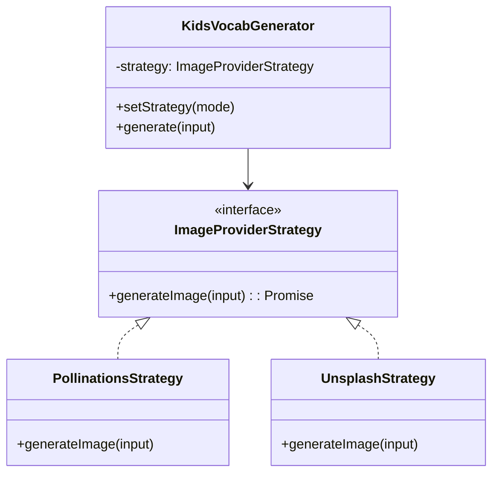

# 小學生英文學習圖片生成器 - 完整規格表

## 📋 項目概述

**項目名稱**: Kids Vocabulary Generator (小學生英文學習圖片生成器)  
**目標用戶**: 6-12歲小學生  
**主要功能**: 輸入英文單字或句子，AI 自動生成對應的卡通風格圖片  
**技術架構**: Node.js + Express + Pug + Bootstrap + Pollinations AI  

## 🎯 核心功能需求

### 1. 圖片生成功能
- **輸入**: 英文單字或句子（最多100字符）
- **輸出**: 卡通風格的 AI 生成圖片
- **API**: 使用 Pollinations 免費 AI 圖片生成服務
- **提示詞策略**: 
  - 單字: `cute cartoon {word}`
  - 句子: `cute cartoon illustration of "{sentence}" for kids, colorful, simple, educational`
- **圖片規格**: 1024x1024px, Flux 模型, 增強模式

### 2. 語音功能
- **自動發音**: 圖片生成後自動播放英文發音
- **手動發音**: 點擊發音按鈕重複播放
- **語音識別**: 練習發音功能（可選）
- **速度控制**: 0.5x - 2.0x 播放速度調整
- **技術**: Web Speech API (SpeechSynthesis + SpeechRecognition)

### 3. 學習記錄
- **最近學習**: 顯示最近5個學過的單字/句子
- **本地存儲**: 使用 localStorage 保存學習記錄
- **快速重用**: 點擊記錄可重新載入到輸入框
- **數據格式**: JSON 格式存儲單字、意思、圖片URL、時間戳

### 4. 單字解釋
- **基本詞彙**: 內建常用單字的中文解釋
- **句型分析**: 自動識別句子類型並提供說明
- **顯示格式**: 單字大寫顯示 + 中文意思

## 🎨 用戶界面設計

### 整體風格
- **色彩主題**: 綠色系 (#28a745, #20c997) + 藍色漸變背景
- **設計風格**: 兒童友善、圓角設計、鮮豔但不刺眼
- **字體**: -apple-system, BlinkMacSystemFont, 'Segoe UI', 'Microsoft YaHei'
- **圖示**: 使用 Emoji + Font Awesome 組合

### 布局結構
```
┌─────────────────────────────────────┐
│          🌟 標題區域 🌟              │
├─────────────────────────────────────┤
│          📝 輸入區域                 │
│  [輸入框] [生成按鈕]                 │
│          ⚙️ 設定區域                 │
│  [自動發音] [練習發音] [速度調整]     │
├─────────────────────────────────────┤
│          🖼️ 圖片顯示區域             │
│  [生成的圖片]                       │
│  [單字資訊] [發音按鈕] [下載按鈕]     │
├─────────────────────────────────────┤
│          📚 學習記錄區域             │
│  [最近學過的內容列表]               │
└─────────────────────────────────────┘
```

## 📱 響應式設計規格

### 手機版 (< 576px)
- **布局**: 全畫面垂直堆疊，無邊距
- **輸入**: 輸入框和按鈕分開排列，按鈕在下一排
- **字體**: 基礎 16px，輸入框 18px，按鈕 18px
- **按鈕**: 100% 寬度，最小高度 50px
- **圖片**: 最大高度 250px，圓角 8px
- **卡片**: 無圓角，無左右邊框，直接貼邊

### 平板版 (576px - 991px)
- **布局**: 全畫面，輸入框和按鈕並排
- **字體**: 基礎 17px，輸入框 19px，按鈕 17px
- **按鈕**: 最小高度 48px
- **圖片**: 最大高度 300px
- **卡片**: 同手機版全畫面設計

### 桌面版 (≥ 992px)
- **布局**: 兩欄式，左側輸入，右側結果
- **容器**: 有邊距和圓角
- **字體**: 標準大小 18px
- **圖片**: 最大高度 400px
- **卡片**: 完整圓角和陰影效果

## 🔧 技術實現規格

### 前端技術棧
- **模板引擎**: Pug (Jade)
- **CSS 框架**: Bootstrap 5.1.3
- **圖示庫**: Font Awesome 6.0.0
- **JavaScript**: 原生 ES6+，無外部框架
- **響應式**: CSS Media Queries + Bootstrap Grid

### 後端技術棧
- **運行環境**: Node.js
- **Web 框架**: Express.js
- **模板引擎**: Pug
- **路由**: Express Router
- **靜態文件**: Express Static

### 核心 JavaScript 類別
```javascript
class KidsVocabularyGenerator {
  constructor() {
    this.isGenerating = false;
    this.recentWords = [];
    this.currentWord = '';
    this.speechSynthesis = window.speechSynthesis;
    this.speechRecognition = null;
  }
  
  // 主要方法
  generateImage()           // 生成圖片主流程
  generatePollinationsUrl() // 生成 AI 圖片 URL
  showResult()             // 顯示生成結果
  pronounceWord()          // 語音播放
  addToRecentWords()       // 添加學習記錄
  loadRecentWords()        // 載入學習記錄
}
```

### API 整合
- **圖片生成**: Pollinations AI API
  - URL: `https://image.pollinations.ai/prompt/{encodedPrompt}`
  - 參數: `width=1024&height=1024&model=flux&enhance=true`
- **語音合成**: Web Speech API
- **語音識別**: Web Speech Recognition API

## 📂 文件結構

```
immersive-viewer1/
├── views/
│   ├── layout.pug                 # 基礎布局模板
│   └── kids-vocabulary.pug        # 主頁面模板
├── public/
│   └── js/
│       ├── kids-vocabulary.js     # 主要 JavaScript 邏輯
│       └── mobile-font-fix.js     # 手機字體修復腳本
├── routes/
│   └── kids-vocabulary.js         # Express 路由
└── docs/
    ├── kids-friendly-responsive.md
    └── responsive-design.md
```

## 🎯 用戶體驗流程

### 標準使用流程
1. **進入頁面** → 看到歡迎訊息和輸入提示
2. **輸入單字** → 在輸入框輸入英文單字或句子
3. **點擊生成** → 點擊「🎨 生成圖片！」按鈕
4. **等待生成** → 顯示載入狀態「正在為你畫圖片...」
5. **查看結果** → 圖片載入完成，顯示單字資訊
6. **自動發音** → 如果開啟自動發音，播放英文讀音
7. **互動功能** → 可重複發音、練習發音、下載圖片
8. **學習記錄** → 自動保存到「最近學過的內容」

### 錯誤處理流程
- **空輸入** → 提示「請輸入英文單字或句子！」
- **輸入過長** → 提示「輸入太長了！請輸入簡短的英文單字或句子。」
- **非英文字符** → 提示「請只輸入英文字母和基本標點符號！」
- **圖片載入失敗** → 顯示錯誤訊息並提供重試選項
- **網路問題** → 提示「網路連線有問題，請再試一次！」

## 🎨 視覺設計規範

### 色彩規範
- **主色調**: #28a745 (成功綠)
- **輔助色**: #20c997 (青綠色)
- **背景漸變**: linear-gradient(135deg, #e3f2fd 0%, #f3e5f5 100%)
- **文字色彩**: #333 (深灰), #6c757d (中灰), #adb5bd (淺灰)
- **邊框色彩**: #28a745 (綠色邊框)

### 字體規範
- **標題**: 1.3rem - 1.75rem (響應式)
- **正文**: 14px - 18px (響應式)
- **輸入框**: 18px - 19px (響應式)
- **按鈕**: 16px - 18px (響應式)
- **小字**: 11px - 14px (響應式)

### 間距規範
- **卡片內距**: 8px - 24px (響應式)
- **元素間距**: 6px - 16px (響應式)
- **按鈕內距**: 8px - 20px (響應式)
- **邊框寬度**: 1px - 3px (響應式)

### 圓角規範
- **手機版**: 4px - 8px (緊湊設計)
- **平板版**: 6px - 10px (平衡設計)
- **桌面版**: 8px - 25px (優雅設計)

## 🔒 安全性和限制

### 輸入驗證
- **長度限制**: 最多 100 字符
- **字符限制**: 只允許英文字母、空格、基本標點符號
- **正則表達式**: `/^[a-zA-Z\s.,!?'-]+$/`

### 內容安全
- **圖片來源**: 僅使用 Pollinations 官方 API
- **提示詞過濾**: 自動添加 "cute cartoon" 和 "for kids" 確保內容適合兒童
- **無用戶上傳**: 不接受用戶上傳的圖片或文件

### 隱私保護
- **無需註冊**: 完全免費使用，無需帳號
- **本地存儲**: 學習記錄僅保存在用戶瀏覽器本地
- **無數據收集**: 不收集用戶個人信息

## 📊 性能要求

### 載入性能
- **首次載入**: < 3 秒
- **圖片生成**: 10-20 秒 (取決於 AI 服務)
- **頁面響應**: < 100ms (本地操作)

### 兼容性要求
- **瀏覽器**: Chrome 80+, Safari 13+, Firefox 75+, Edge 80+
- **設備**: iPhone 6+, Android 7+, iPad, 桌面電腦
- **網路**: 支援 3G 以上網路環境

## 🧪 測試規範

### 功能測試
- **圖片生成**: 測試各種單字和句子的圖片生成
- **語音功能**: 測試發音播放和語音識別
- **響應式**: 測試各種螢幕尺寸的顯示效果
- **學習記錄**: 測試記錄保存和載入功能

### 兼容性測試
- **多瀏覽器**: Chrome, Safari, Firefox, Edge
- **多設備**: iPhone, Android, iPad, 桌面
- **多解析度**: 375px - 1920px 寬度範圍

### 錯誤測試
- **網路中斷**: 測試離線狀態的錯誤處理
- **API 失敗**: 測試 AI 服務不可用的情況
- **輸入錯誤**: 測試各種無效輸入的處理

## 🚀 部署規範

### 環境要求
- **Node.js**: 14.x 或更高版本
- **NPM**: 6.x 或更高版本
- **記憶體**: 最少 512MB RAM
- **存儲**: 最少 1GB 可用空間

### 環境變數
```bash
NODE_ENV=production
PORT=3000
```

### 啟動命令
```bash
npm install
npm start
```

### 部署平台
- **推薦**: Zeabur, Vercel, Heroku
- **要求**: 支援 Node.js 的雲端平台
- **域名**: 支援 HTTPS 的自定義域名

## 📝 維護和更新

### 定期維護
- **依賴更新**: 每月檢查並更新 npm 套件
- **安全檢查**: 使用 `npm audit` 檢查安全漏洞
- **性能監控**: 監控頁面載入速度和 API 響應時間

### 功能擴展
- **新語言支援**: 可擴展支援其他語言學習
- **更多 AI 服務**: 可整合其他圖片生成 API
- **學習統計**: 可添加學習進度追蹤功能
- **社交分享**: 可添加分享生成圖片的功能

## 🎯 成功指標

### 用戶體驗指標
- **頁面載入時間**: < 3 秒
- **圖片生成成功率**: > 95%
- **跨設備兼容性**: 支援 95% 的目標設備
- **用戶滿意度**: 簡單易用，適合兒童操作

### 技術指標
- **代碼覆蓋率**: > 80%
- **錯誤率**: < 1%
- **可用性**: > 99.5%
- **響應時間**: 本地操作 < 100ms

---

## 📋 實現檢查清單

### 核心功能 ✅
- [x] 英文單字/句子輸入
- [x] AI 圖片生成 (Pollinations)
- [x] 自動語音播放
- [x] 手動發音控制
- [x] 語音速度調整
- [x] 語音識別練習
- [x] 學習記錄保存
- [x] 圖片下載功能

### 響應式設計 ✅
- [x] 手機版全畫面布局
- [x] 平板版優化
- [x] 桌面版多欄布局
- [x] 觸控友善設計
- [x] 字體大小適配

### 用戶體驗 ✅
- [x] 兒童友善界面
- [x] 錯誤處理和提示
- [x] 載入狀態顯示
- [x] 操作反饋
- [x] 無需註冊使用

### 技術實現 ✅
- [x] Node.js + Express 後端
- [x] Pug 模板引擎
- [x] Bootstrap 響應式框架
- [x] 原生 JavaScript 前端
- [x] Web Speech API 整合

這個規格表提供了完整的技術細節和實現指南，AI 可以根據這個規格重新創建整個小學生英文學習圖片生成器頁面。

## 👨‍🏫 教師介面規格 (Teacher Interface)

### 1. 核心概念：神奇連結 (Magic Link)
- **目標**: 讓老師能快速產生一組單字，學生免登入即可練習
- **運作方式**: 
  1. 老師在「產生器頁面」輸入單字列表
  2. 系統生成帶有參數的網址 (Magic Link) 和 QR Code
  3. 學生掃描/點擊連結，自動載入單字並準備生成

### 2. 功能需求

#### 🅰️ 老師端 (連結產生器)
- **路徑**: `/teacher` (隱藏入口)
- **輸入**: 多行文字框，每行一個單字/句子
- **設定**: 
  - 是否隱藏中文意思 (考卷模式)
  - 是否自動播放發音
- **輸出**:
  - 專屬短網址 (或帶參數的長網址)
  - 大尺寸 QR Code (方便投影)
  - 「複製連結」按鈕

#### 🅱️ 學生端 (接收模式)
- **觸發**: 當網址帶有 `?words=apple,banana,cat` 參數時
- **介面變化**:
  - 自動切換為「課程模式」
  - 輸入框上方顯示「📜 今天的任務」清單
  - 單字以「按鈕」形式呈現，點擊即載入+生成
- **防呆機制**:
  - 防止重複點擊
  - 完成的單字打勾 ✅

### 3. URL 參數設計
- `words`: 以逗號分隔的單字列表 (URL Encoded)
- `mode`: `practice` (預設) | `quiz` (隱藏意思)
- `auto`: `true` | `false` (自動發音開關)
- 範例: `.../kids-vocabulary?words=apple,banana,cat&mode=quiz`

## 5. 第二圖源整合 (Second Image Source) - 為真實認知而生

### 5.1 核心目標 (Core Objective)
為了解決 AI 生成圖片偶爾過於抽象、或無法準確呈現特定現實物體（如特定動物、地標）的問題，引入 **Unsplash (真實照片)** 作為第二圖源。
這將允許使用者在「🎨 創意想像 (AI)」與「📸 真實認知 (Real Photo)」之間自由切換。

### 5.2 使用者介面設計 (UI/UX)
在輸入框與生成按鈕之間（或附近），新增一個顯眼的模式切換器：

- **UI 元件**: 
  - **切換開關 (Segmented Control / Toggle)**
  - 選項 A: `🎨 AI 卡通` (預設, Pollinations, 適合句子/故事)
  - 選項 B: `📸 真實照片` (Unsplash, 適合單字/生物/物體)

- **互動行為**:
  - 切換至「真實照片」時，輸入框提示改為「建議輸入單一單字 (例: Fox, Apple)...」
  - 若使用者在「真實照片」模式輸入過長句子，顯示黃色提示：「真實照片模式適合單字搜尋喔！」

### 5.3 技術架構：策略模式 (Strategy Pattern)
重構 `KidsVocabularyGenerator`，將圖片獲取邏輯抽離為獨立策略。



### 5.4 後端代理設計 (Backend Proxy) - 安全性關鍵 🔒
由於 Unsplash API 需要 Access Key，且免費額度有限 (Demo: 50 req/hr)，**嚴禁**將 Key 暴露在前端 JavaScript 中。

#### 5.4.1 API Endpoint
- **路徑**: `GET /api/images/search`
- **參數**: 
  - `q`: 搜尋關鍵字 (String)
  - `source`: `unsplash` (預留未來擴充)
- **回應**:
  ```json
  {
    "success": true,
    "imageUrl": "https://images.unsplash.com/photo-xxx...",
    "provider": "unsplash",
    "photographer": "John Doe",
    "photographerUrl": "https://unsplash.com/@johndoe"
  }
  ```

#### 5.4.2 後端邏輯 (Node.js/Express)
1. **驗證**: 檢查請求來源/頻率 (Rate Limiting)。
2. **快取 (Caching)**: **關鍵功能**。
   - 使用 `node-cache` 或簡單記憶體快取。
   - Key: `unsplash_query_${keyword}`
   - TTL: 24小時 (相同的單字如 "apple" 一天內只打一次 Unsplash API)。
   - **目的**: 大幅節省 API 額度，單字量通常有限，快取命中率高。
3. **API 呼叫**: 使用 `node-fetch` 呼叫 Unsplash API。
4. **錯誤處理**: 若 Unsplash 額度用盡或失敗，回傳特定錯誤代碼，前端自動切換回 AI 模式或顯示提示。

### 5.5 實作計畫 (Implementation Plan)

#### Phase 1: 後端基礎
1.  申請 Unsplash Developer Account 獲取 Access Key。
2.  在 `.env` 加入 `UNSPLASH_ACCESS_KEY`。
3.  建立 `routes/api.js` (或擴充 existing routes) 實作 Proxy & Cache。

#### Phase 2: 前端重構
1.  建立 `strategies/ImageStrategies.js` 模組。
2.  實作 `PollinationsStrategy` (原邏輯) 與 `UnsplashStrategy` (呼叫後端)。
3.  修改 `KidsVocabularyGenerator` 支援策略切換。

#### Phase 3: UI 整合
1.  在 `kids-vocabulary.pug` 加入切換按鈕。
2.  在 `kids-vocabulary.js` 綁定切換事件。
3.  顯示 Unsplash 規範要求的「Photo by [User] on Unsplash」來源標示。