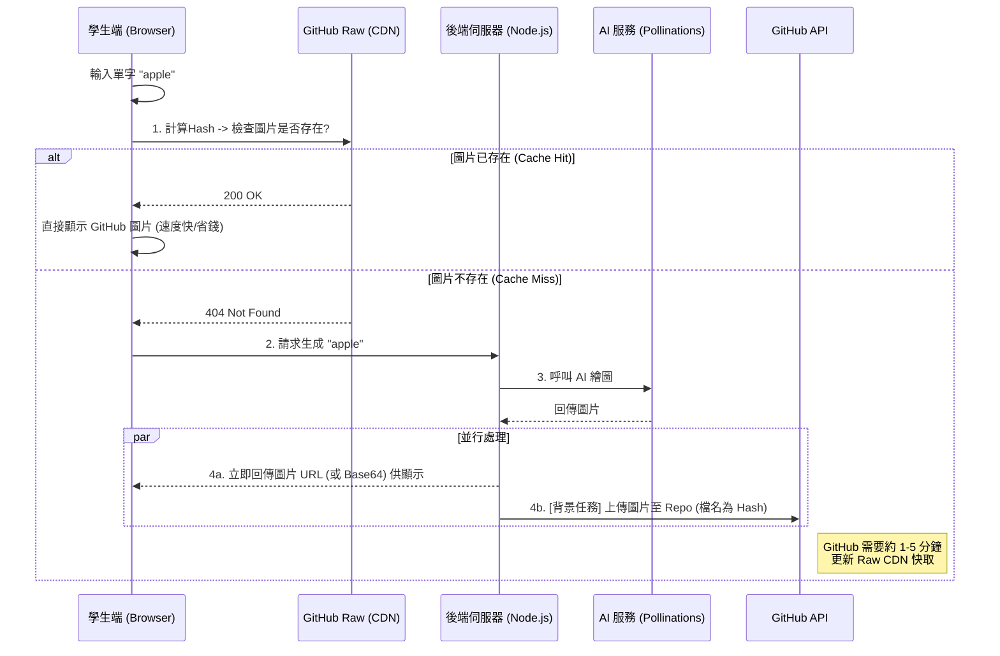

# 📦 GitHub 圖庫持久化方案 (GitHub Image Persistence Plan)

## 1. 核心概念
將 GitHub Repository 作為圖片的「永久圖書館」。
當學生查詢單字時，優先從 GitHub 讀取「已歸檔」的圖片；若無，則即時生成並由後端自動「存檔」回 GitHub。

## 2. 系統架構流 (Workflow)

## 3. 詳細技術規格

### 3.1 前端邏輯 (Frontend)
在此架構下，前端需要先進行一次「探測」。

*   **GitHub Pages URL 規則**: 
    `https://{Owner}.github.io/{Repo}/public/library/{hash}.jpg`
    (需在 GitHub Repo 設定 Pages Source 為 `main` branch, `/` root folder)
*   **邏輯**:
    1.  User 輸入 `apple`。
    2.  前端計算 Hash: `sha256("apple")` -> `3a7bd3...`
    3.  Fetch `.../library/3a7bd3....jpg` (Method: HEAD)。
    4.  若 `ok`: `img.src = url`。
    5.  若 `404`: 呼叫後端 API `/api/generate`。

### 3.2 後端邏輯 (Backend)
後端需要新增 GitHub 寫入能力。

*   **依賴套件**: `npm install @octokit/rest`
*   **環境變數**:
    *   `GITHUB_TOKEN`: 需要有 `repo` 權限的 Personal Access Token (PAT)。
*   **API 實作 (`/api/generate`)**:
    1.  接收請求。
    2.  檢查 AI 服務獲取圖片 Buffer。
    3.  **回應使用者**: 立即回傳 AI 的原始 URL 或 Proxy URL。
    4.  **非同步上傳**: 計算 Hash，使用 Octokit 推送到 `public/library/{hash}.jpg`。

### 3.3 檔名策略 (Naming Strategy) - Hash ID
採用 **Hash (雜湊值)** 作為檔名，確保唯一性並解決特殊字元問題。

*   **演算法**: SHA-256 (取前 12 碼，足夠避免碰撞且網址短)。
*   **計算方式**: `Hex(SHA-256(Lowercase(Trim(Input))))`
*   **範例**:
    *   Input: `Apple` -> `apple` -> `3a7bd3...` -> `3a7bd3e2f1a8.jpg`
    *   Input: `I'm Happy!` -> `i'm happy!` -> `8d2f1a...` -> `8d2f1ab9c0d1.jpg`
*   **優點**: 完全不必處理檔名中的空白、Emoji 或特殊符號問題。
*   **注意**: 無法從檔名反推單字 (One-way)，但依賴前端由 Input 再次 Hash 來命中圖片。

## 4. 關鍵問題與討論 (Discussion & Risks)

### ⚠️ 問題 1: GitHub Raw CDN 延遲 (Latency)
*   **現象**: 剛上傳的檔案，透過 `raw.githubusercontent.com` 讀取時，可能會有 1~5 分鐘的快取延遲。
*   **解決方案**: 接受短期重複生成。

### ⚠️ 問題 2: 並發衝突 (Concurrency)
*   **現象**: 全班 30 人同時輸入 "dog"。
*   **解決方案**: 後端加入 **Queue (隊列)** 機制，若遇到 409 (檔案已存在)，直接忽略錯誤。

### ⚠️ 問題 3: GitHub 儲存庫限制
*   **限制**: 建議單一 Repo 不超過 1GB。
*   **策略**: 圖片壓縮為 JPG (Quality 80%)，每張約 100-200KB。

## 5. 建議實作步驟
1.  **安裝**: `npm install @octokit/rest`
2.  **配置**: 申請一個專用的 GitHub Bot 帳號 (或是用您原本的) 產生 Token。
3.  **開發**: 實作後端 `uploadToGitHub` 函數。
4.  **部屬**: 確保伺服器有寫入權限。
